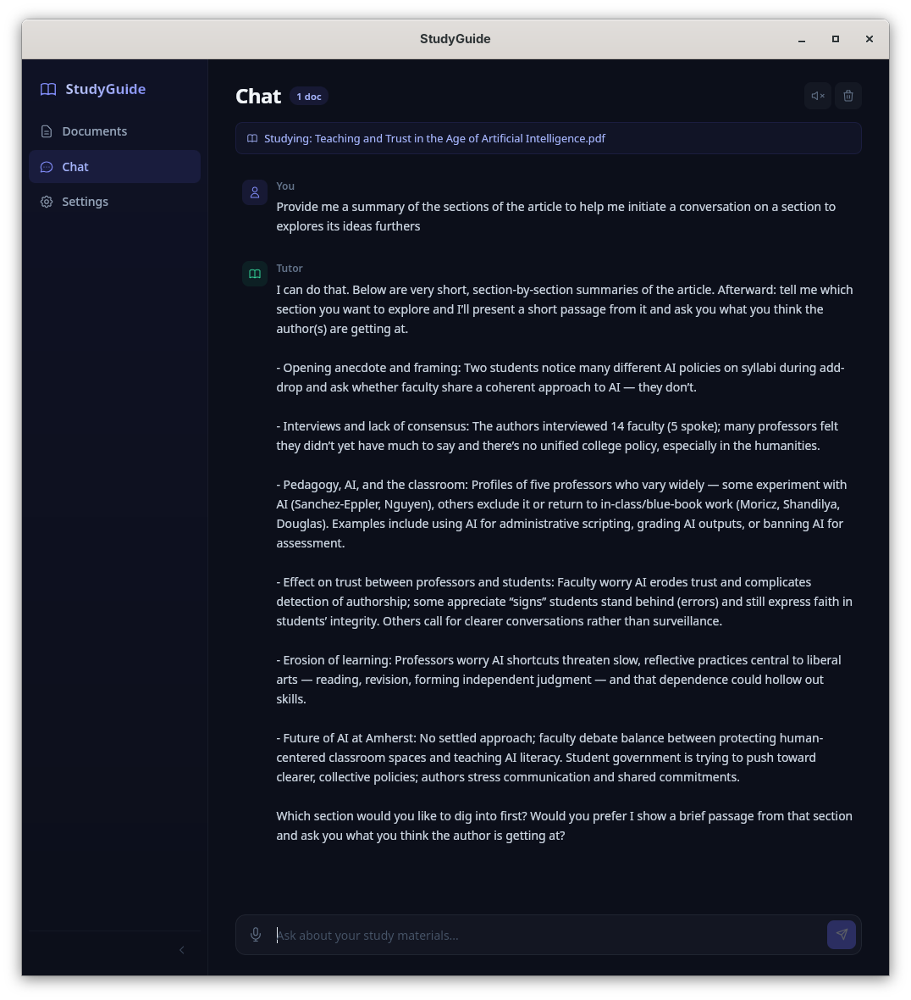

# StudyGuide

A desktop reading companion that helps you deeply engage with study materials. Load documents (PDF, DOCX, TXT, Markdown), and have a conversation with an AI tutor that walks you through the text section by section — challenging your thinking without telling you what to think.

Built with [Tauri](https://tauri.app), [SvelteKit](https://svelte.dev), and Rust.



## Features

- **Guided reading** — The AI presents sections of your documents and invites discussion, rather than dumping summaries
- **Intellectual sparring** — Challenges your interpretations, plays devil's advocate, surfaces hidden assumptions
- **Voice input** — Hold Space to talk, powered by local Whisper speech-to-text (fully offline)
- **Voice output** — Toggle "Read aloud" for AI responses, powered by OpenAI-compatible TTS API
- **Streaming responses** — AI replies appear word-by-word as they're generated
- **Multiple documents** — Load and select which documents to discuss
- **Keyboard-driven** — Hold Space to record, Enter to send, collapsible sidebar

## Supported document formats

- PDF
- DOCX (Microsoft Word)
- TXT
- Markdown

## Requirements

- An OpenAI-compatible chat API (OpenAI, Azure OpenAI, or any compatible endpoint)
- For voice output: an OpenAI-compatible TTS API (optional)
- Linux (other platforms not yet tested)

## Getting started

1. Download the latest release from the [Releases](https://github.com/ChrisL-GU/StudyGuide/releases) page
2. Launch StudyGuide
3. Go to **Settings** and configure your API key and endpoint
4. Go to **Documents**, click **Add Document**, and load a file
5. Go to **Chat** and start a conversation

### Voice setup

**Speech-to-text (input):** Go to Settings and click "Download Whisper Model" (~142MB). This runs entirely on your machine.

**Text-to-speech (output):** Requires an OpenAI-compatible TTS API. Configure the TTS endpoint in Settings (it can use a different API key and base URL than the chat API). Toggle "Read aloud" in the Chat header.

## Keyboard shortcuts

| Shortcut | Action |
|---|---|
| Hold Space | Record voice (release to transcribe) |
| Enter | Send message (works globally) |
| Shift+Enter | Newline in text input |

---

## Developer guide

### Prerequisites

- [Node.js](https://nodejs.org/) (v18+)
- [Rust](https://rustup.rs/) (latest stable)
- Tauri system dependencies for Linux:

  ```bash
  # Fedora
  sudo dnf install webkit2gtk4.1-devel openssl-devel gtk3-devel libappindicator-gtk3-devel librsvg2-devel

  # Ubuntu/Debian
  sudo apt install libwebkit2gtk-4.1-dev libssl-dev libgtk-3-dev libayatana-appindicator3-dev librsvg2-dev
  ```

- Build dependencies for Whisper (whisper.cpp compiled via `whisper-rs`):

  ```bash
  # Fedora
  sudo dnf install cmake gcc-c++ clang-devel

  # Ubuntu/Debian
  sudo apt install cmake g++ libclang-dev
  ```

### Setup

```bash
git clone https://github.com/ChrisL-GU/StudyGuide.git
cd StudyGuide
npm install
```

### Development

```bash
npx tauri dev
```

This starts the Vite dev server and the Tauri app together. The frontend hot-reloads on changes. Rust backend changes trigger a recompile automatically.

### Build for production

```bash
npx tauri build
```

The built app will be in `src-tauri/target/release/bundle/`.

### Project structure

```
StudyGuide/
  src/                    # SvelteKit frontend
    lib/
      audio.ts            # Web Audio API recording/playback
      tauri.ts            # Typed Tauri command wrappers
      stores.svelte.ts    # Shared reactive state
      voiceState.svelte.ts # Voice UI state
      types.ts            # TypeScript interfaces
    routes/
      chat/               # Chat interface
      documents/           # Document management
      settings/            # API and voice configuration
  src-tauri/              # Rust backend
    src/
      lib.rs              # Tauri app setup and command registration
      commands.rs         # Tauri command handlers
      api.rs              # OpenAI-compatible API client (streaming)
      parser.rs           # Document parsing (PDF, DOCX, TXT, MD)
      settings.rs         # Settings persistence
      voice.rs            # Whisper STT and model management
```

### Key design decisions

- **Full document context** — Documents are sent in full to the AI rather than using RAG. This keeps the architecture simple and works well for the guided reading use case.
- **Local STT, cloud TTS** — Whisper runs locally for privacy and zero latency. TTS uses a cloud API for natural-sounding voice quality.
- **Streaming chat** — The backend reads SSE chunks from the API and emits Tauri events to the frontend for real-time display.
- **Separate TTS endpoint config** — TTS can use a different API key, base URL, and API version than the chat API (useful for Azure where they may be different resources).

## Built with AI

This project was built entirely using [Claude Code](https://claude.ai/claude-code) (Claude Opus 4.6) — from architecture and design decisions through to every line of code, styling, and documentation.

## License

This project is licensed under the MIT License. See [LICENSE](LICENSE) for details.
